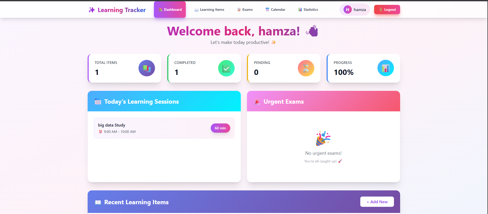
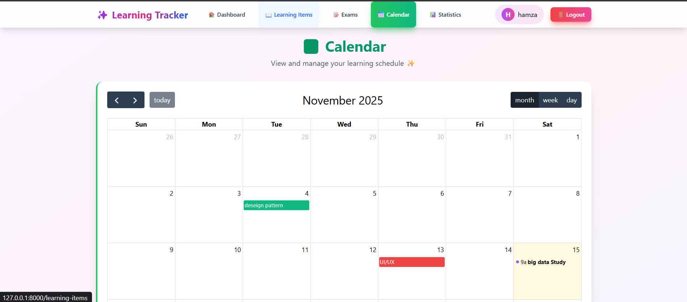
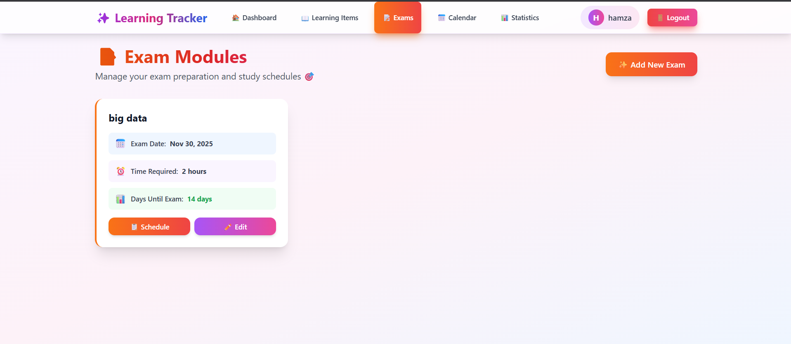
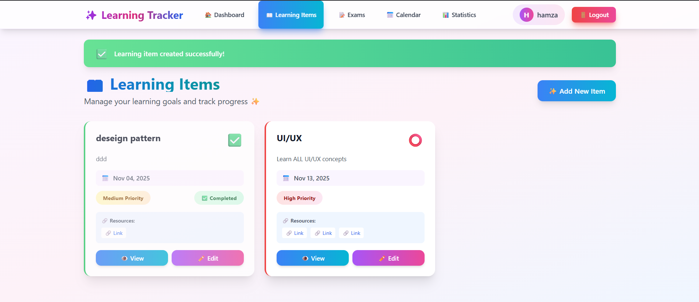
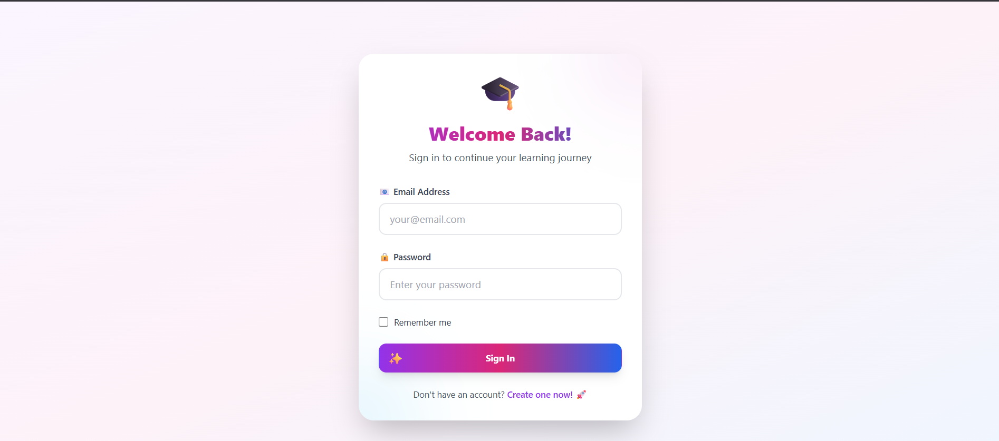
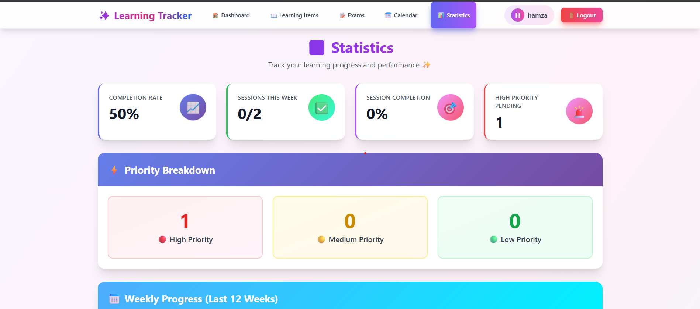

# Learning Tracker Application

A professional Learning Tracker web application built with Laravel (backend) and MySQL (database). This application helps users manage their learning goals, track progress, schedule study sessions, and prepare for exams.

## Features

### 1. Learning Management
- Add learning items with title, description, links/resources, and target dates
- Organize learning items by weeks, days, and times
- Set priority levels (low, medium, high)
- Mark items as completed

### 2. Calendar & Scheduling
- Professional calendar interface showing all learning items
- Interactive calendar with drag-and-drop functionality
- View learning sessions and exam dates
- Track scheduled study sessions

### 3. Exam Preparation
- Add exam modules with module name, exam date, and time required
- Automatic generation of suggested study schedules
- Highlight urgent exams (less than 7 days remaining)
- Track exam preparation progress

### 4. Dashboard
- Overview statistics (total items, completed items, completion rate)
- Today's learning sessions
- Urgent exams alert
- Recent learning items

### 5. Statistics & Progress Tracking
- Weekly and monthly progress statistics
- Completion rates
- Priority breakdown
- Session completion tracking

### 6. User Authentication
- User registration and login
- Secure password hashing
- Session management

# Learning Tracker Application

A professional Learning Tracker web application built with Laravel (backend) and MySQL (database). This application helps users manage their learning goals, track progress, schedule study sessions, and prepare for exams.

## Features

### 1. Learning Management
- Add learning items with title, description, links/resources, and target dates
- Organize learning items by weeks, days, and times
- Set priority levels (low, medium, high)
- Mark items as completed

### 2. Calendar & Scheduling
- Professional calendar interface showing all learning items
- Interactive calendar with drag-and-drop functionality
- View learning sessions and exam dates
- Track scheduled study sessions

### 3. Exam Preparation
- Add exam modules with module name, exam date, and time required
- Automatic generation of suggested study schedules
- Highlight urgent exams (less than 7 days remaining)
- Track exam preparation progress

### 4. Dashboard
- Overview statistics (total items, completed items, completion rate)
- Today's learning sessions
- Urgent exams alert
- Recent learning items

### 5. Statistics & Progress Tracking
- Weekly and monthly progress statistics
- Completion rates
- Priority breakdown
- Session completion tracking

### 6. User Authentication
- User registration and login
- Secure password hashing
- Session management

## Installation

### Prerequisites
- PHP >= 8.1
- Composer
- MySQL
- Node.js and npm

### Setup Steps

1. **Clone or navigate to the project directory**
   ```bash
   cd cursor
   ```

2. **Install PHP dependencies**
   ```bash
   composer install
   ```

3. **Install Node.js dependencies**
   ```bash
   npm install
   ```

4. **Create environment file**
   ```bash
   cp .env.example .env
   ```

5. **Generate application key**
   ```bash
   php artisan key:generate
   ```

6. **Configure database in `.env`**
   ```env
   DB_CONNECTION=mysql
   DB_HOST=127.0.0.1
   DB_PORT=3306
   DB_DATABASE=learning_tracker
   DB_USERNAME=root
   DB_PASSWORD=your_password
   ```

7. **Create database**
   ```sql
   CREATE DATABASE learning_tracker;
   ```

8. **Run migrations**
   ```bash
   php artisan migrate
   ```

9. **Build frontend assets**
   ```bash
   npm run build
   ```

10. **Start development server**
    ```bash
    php artisan serve
    ```

11. **In another terminal, start Vite dev server (for development)**
    ```bash
    npm run dev
    ```

## Usage

1. **Register a new account** at `/register`
2. **Login** at `/login`
3. **Access the dashboard** to see your overview
4. **Add learning items** from the Learning Items page
5. **Add exam modules** from the Exams page (study schedules are auto-generated)
6. **View calendar** to see all scheduled items
7. **Check statistics** to track your progress

## Project Structure

```
├── app/
│   ├── Http/
│   │   ├── Controllers/
│   │   │   ├── Auth/          # Authentication controllers
│   │   │   ├── DashboardController.php
│   │   │   ├── LearningItemController.php
│   │   │   ├── ExamModuleController.php
│   │   │   ├── CalendarController.php
│   │   │   └── StatisticsController.php
│   │   └── Middleware/        # Custom middleware
│   ├── Models/                # Eloquent models
│   ├── Policies/              # Authorization policies
│   └── Providers/             # Service providers
├── database/
│   └── migrations/            # Database migrations
├── resources/
│   ├── views/                 # Blade templates
│   ├── css/                   # CSS files
│   └── js/                    # JavaScript files
├── routes/
│   ├── web.php                # Web routes
│   └── api.php                # API routes
└── config/                    # Configuration files
```

## Database Schema

- **users**: User accounts
- **learning_items**: Learning goals and items
- **exam_modules**: Exam information
- **learning_sessions**: Scheduled study sessions

## Technologies Used

- **Backend**: Laravel 10
- **Database**: MySQL
- **Frontend**: Blade templates with Tailwind CSS
- **JavaScript**: FullCalendar.js for calendar functionality
- **Build Tool**: Vite

## License

MIT License

## Screenshots

Below are screenshots taken from the running application. Files are located in the `screenshots/` folder.

### Dashboard


### Calendar View


### Exams


### Learning Items


### Login


### Sign In (alternate)


### Month Progress


### Weekly Progress


### Statistics

